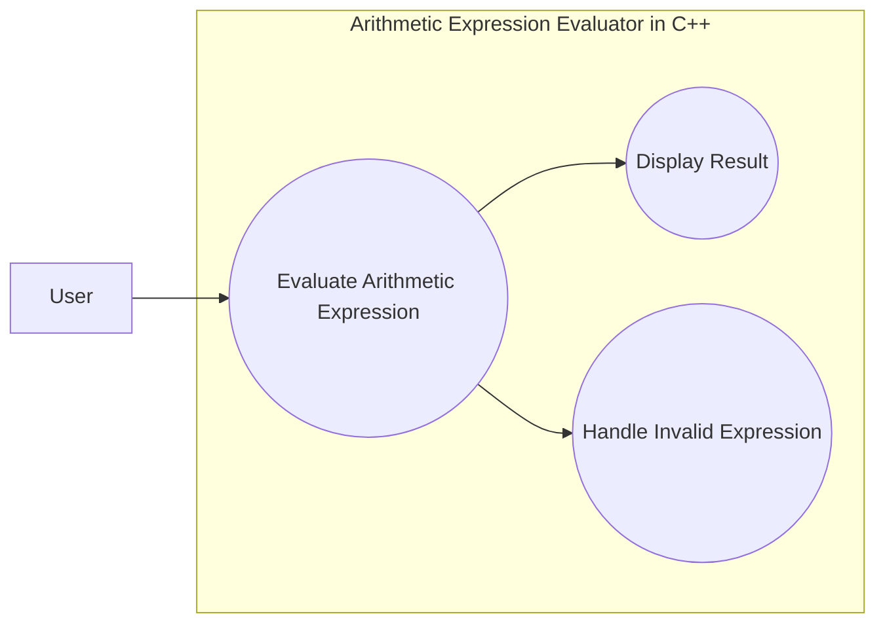

---

# Group 3

---

# Arithmetic Expression Evaluator in C++
**Version:** 1.1   
**Date:** 03/10/2026  
**Document Identifier:** Software Architecture Document

---

# Software Architecture Document
## Version 1.1

---

| Date | Version | Description | Author |
|------|---------|------------|--------|
| 03/10/2026 | 1.0 | Initial creation and conversion of Deliverable 3 into GitHub using Markdown format | Ivan Kullaya |
| 03/19/2026 | 1.1 | Addition of Sections 4, 4.1, & 8 | Ivan Kullaya |
| <dd/mm/yyyy> | x.x | 
 | <name> |

---

## Table of Contents

1. Introduction  
   - 1.1 Purpose  
   - 1.2 Scope  
   - 1.3 Definitions, Acronyms, and Abbreviations  
   - 1.4 References  
   - 1.5 Overview  
2. Architectural Representation  
3. Architectural Goals and Constraints
4. Use-Case View
    - 4.1 Use-Case Realizations
5. Logical View
    - 5.1 Overview
    - 5.2 Architecturally Significant Design Packages
6. Interface Description
7. Size and Performance
8. Quality

---

# 1. Introduction
[The introduction of the Software Architecture Document provides an overview of the entire Software
Architecture Document. It includes the purpose, scope, definitions, acronyms, abbreviations, references,
and overview of the Software Architecture Document.]

## 1.1 Purpose
[This document provides a comprehensive architectural overview of the system, using a number of different
architectural views to depict different aspects of the system. It is intended to capture and convey the
significant architectural decisions which have been made on the system.]

[This section defines the role or purpose of the Software Architecture Document, in the overall project
documentation, and briefly describes the structure of the document. The specific audiences for the
document are identified, with an indication of how they are expected to use the document.]

## 1.2 Scope
[A brief description of what the Software Architecture Document applies to; what is affected or influenced
by this document.]

## 1.3 Definitions, Acronyms, and Abbreviations
[This subsection provides the definitions of all terms, acronyms, and abbreviations required to properly
interpret the Software Architecture Document. This information may be provided by reference to the
project’s Glossary.]

## 1.4 References
[This subsection provides a complete list of all documents referenced elsewhere in the Software
Architecture Document. Identify each document by title, report number (if applicable), date, and
publishing organization. Specify the sources from which the references can be obtained. This information
may be provided by reference to an appendix or to another document.]

## 1.5 Overview
[This subsection describes what the rest of the Software Architecture Document contains and explains
how the Software Architecture Document is organized.]

---

# 2. Architectural Representation
[This section describes what software architecture is for the current system, and how it is represented. It
enumerates the views that are necessary, and for each view, explains what types of model elements it
contains.]

---

# 3. Architectural Goals and Constraints
[This section describes the software requirements and objectives that have some significant impact on the
architecture; for example, safety, security, privacy, use of an off-the-shelf product, portability, distribution,
and reuse. It also captures the special constraints that may apply: design and implementation strategy,
development tools, team structure, schedule, legacy code, and so on.]

---

# 4. Use-Case View
The primary use case of the Arithmetic Expression Evaluator is the evaluation of arithmetic expressions entered by the user through a command-line interface. This use case is architecturally significant because it exercises the major components of the system, including input handling, tokenization, parsing, evaluation, and output generation.

The UML use-case diagram below illustrates the central interaction between the user and the system.

**Actor**: User

**Use Cases**:
- Evaluate Arithmetic Expression
- Display Result
- Handle Invalid Expression

The “Evaluate Arithmetic Expression” use case represents the main system functionality. Depending on whether the input is valid or invalid, the system either displays the computed result or generates the appropriate error message.

## 4.1 Use-Case Realizations
The primary use-case realization for this system is the process of evaluating an arithmetic expression entered by the user.

1. The user enters an arithmetic expression through the command-line interface.
2. The input handler receives the expression as a text string.
3. The tokenizer converts the input into a sequence of tokens such as numeric constants, operators, and parentheses.
4. The parser processes the token stream according to operator precedence and associativity rules.
5. The evaluator computes the result of the parsed expression.
6. The output component displays either:
   - The correct numerical result
   - A descriptive error message if the expression is invalid.

This realization demonstrates how the system components (input handler, tokenizer, parser, evaluator, and output handler) collaborate to implement the primary system functionality.

---

# 5. Logical View
[This section describes the architecturally significant parts of the design model, such as its decomposition
into subsystems and packages. And for each significant package, its decomposition into classes and class
utilities. You should introduce architecturally significant classes and describe their responsibilities, as well
as a few very important relationships, operations, and attributes.]

## 5.1 Overview
[This subsection describes the overall decomposition of the design model in terms of its package hierarchy
and layers.]

## 5.2 Architecturally Significant Design Modules or Packages
[For each significant package, include a subsection with its name, its brief description, and a diagram with
all significant classes and packages contained within the package.

For each significant class in the package, include its name, brief description, and, optionally, a description
of some of its major responsibilities, operations, and attributes.]

---

# 6. Interface Description
[A description of the major entity interfaces, including screen formats, valid inputs, and resulting outputs.
If a User-Interface Prototype Document is available, refer to it in this section]

---

# 7. Size and Performance
[A description of the major dimensioning characteristics of the software that impact the architecture, as
well as the target performance constraints.]

---

# 8. Quality
The software architecture of the Arithmetic Expression Evaluator is designed to support key quality attributes beyond basic functionality.

- **Reliability**: The system is designed to handle invalid input smoothly. It shall detect errors such as division by zero, invalid characters, and mismatched parentheses without crashing, and provide clear error messages to the user.
- **Maintainability**: The system is structured into modular components (tokenizer, parser, evaluator), allowing developers to easily modify or extend functionality. This supports future enhancements such as floating-point support or additional operators.
- **Portability**: The system is implemented in standard C++ and relies only on the C++ Standard Library. This ensures compatibility across multiple platforms, including Windows, macOS, and Linux.
- **Usability**: The system uses a simple command-line interface with clear prompts and readable output. Users can easily enter expressions and interpret results without requiring specialized training.
- **Extensibility**: The architecture allows for future expansion, such as:
   - Support for floating-point numbers
   - Additional operators
   - Enhanced parsing capabilities
- **Performance**: The system is expected to evaluate arithmetic expressions efficiently, with near-instant response time for typical input sizes on standard computing hardware.
- **Robustness**: The system is designed to handle a wide range of valid and invalid inputs without failure, ensuring stable operation under different user scenarios.

---

© Group 3, 2026
