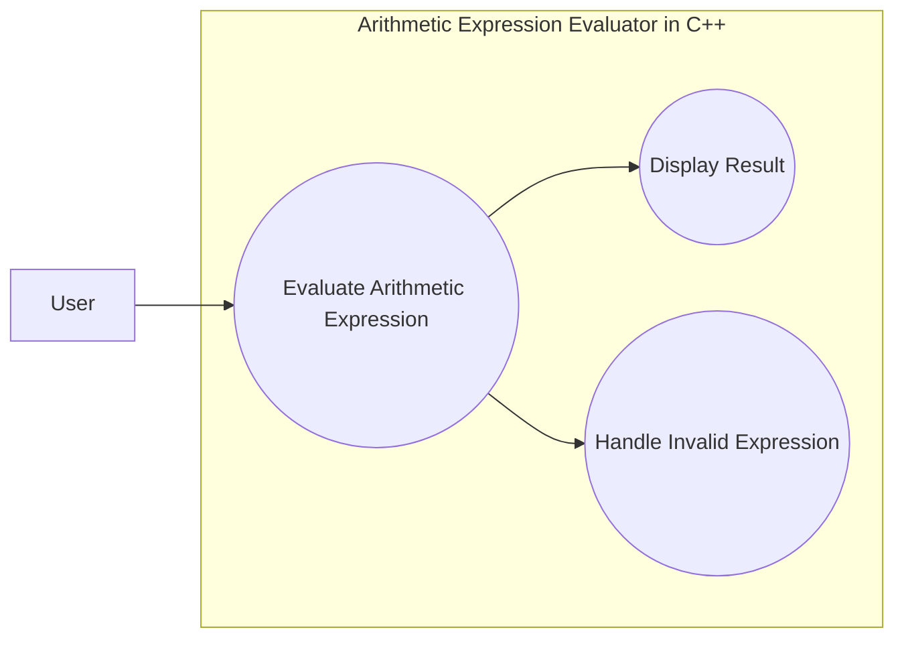

---

# Group 3

---

# Arithmetic Expression Evaluator in C++
**Version:** 1.3   
**Date:** 03/10/2026  
**Document Identifier:** AEE-SA-1.3

---

# Software Architecture Document
## Version 1.3

---

| Date | Version | Description | Author |
|------|---------|------------|--------|
| 03/10/2026 | 1.0 | Initial creation and conversion of Deliverable 3 into GitHub using Markdown format | Ivan Kullaya |
| 03/19/2026 | 1.1 | Addition of Sections 4, 4.1, & 8 | Ivan Kullaya |
| 03/24/2026 | 1.2 | Addition of Section 6 | Aaron Trites |
| 03/31/2026 | 1.3 | Addition of Section 1.4, 2 | Greeshma Kunduri |
| 04/04/2026 | 1.4 | Addition of Sections 5 & 5.1 | Jerry Merveille |
| 04/12/2026 | 1.5 | Addition of Section 3 | Abina Arshad |
---

## Table of Contents

1. Introduction  
   - 1.1 Purpose  
   - 1.2 Scope  
   - 1.3 Definitions, Acronyms, and Abbreviations  
   - 1.4 References  
   - 1.5 Overview  
2. Architectural Representation  
3. Architectural Goals and Constraints
4. Use-Case View
    - 4.1 Use-Case Realizations
5. Logical View
    - 5.1 Overview
    - 5.2 Architecturally Significant Design Packages
6. Interface Description
7. Size and Performance
8. Quality

---

# 1. Introduction

[The introduction of the Software Architecture Document provides an overview of the entire Software
Architecture Document. It includes the purpose, scope, definitions, acronyms, abbreviations, references,
and overview of the Software Architecture Document.]

## 1.1 Purpose
The purpose of the Software Architecture Document is to provide an overview of the structure and design for the evaluator. It describes the system’s components. 

The audience for this document includes project leader, QA testing leader, GitHub manager, requirements leader, documentation leader, technical leader, integration leader and instructors. It will be used as a reference for the team members to ensure consistency and organization. 

## 1.2 Scope
The Software Architecture Document is designed to be used as a guide for the team by providing structure and organization of the Arithmetic Expression Evaluator system. The system uses arithmetic expressions including these operators: +, -, *, /, %, and **. 

This document covers the system’s input and error handling, parsing, tokenization, and expression evaluation. The components work together to evaluate the expressions.  

## 1.3 Definitions, Acronyms, and Abbreviations
* Error Handling: Detects and manages errors that occur during program execution. 

* Evaluator: Calculates the final result of the parsed expression. 

* Parser: A component that takes the user’s input and organizes it according to the correct order of operations.
 
* PEMDAS: The order of operations: parentheses, exponents, multiplication, division, addition, and subtraction.

* Tokenizer: Converts user input into tokens such as numbers, operators, and parentheses.

## 1.4 References
- EECS 348: Software Engineering – Project Description (Arithmetic Expression Evaluator)
University of Kansas, Department of EECS
Spring 2026
Course materials (Canvas and lecture notes)
- Software Development Plan (SDP) – Arithmetic Expression Evaluator
Version 1.15
EECS 348 Project Team
02/19/2026
Project GitHub Repository
- Software Requirements Specification (SRS) – Arithmetic Expression Evaluator
Version 1.9
- EECS 348 Project Team
02/23/2026
Project GitHub Repository
- UPEDU Software Architecture Document Template
University of Kansas, EECS 348 Course Materials
Spring 2026
Provided by instructor (Hossein Saiedian)
- C++ Standard Library Reference
ISO C++ / cppreference
https://en.cppreference.com

## 1.5 Overview
This document explains how our Arithmetic Expression Evaluator works and how it’s structured. It starts with the purpose and scope, then introduces important terms and references needed to understand the system.

The main part of the document shows the system from different angles. First, we explain the overall architecture and the goals and constraints that guided our design. Next, we describe the use-case view, showing how the user interacts with the program and how the system responds. Then, the logical view breaks down the system into the main modules, explains what each does, and shows how they work together.

Finally, we cover the interface, performance expectations, and quality attributes like reliability, maintainability, and usability. The goal of this document is to give anyone reading it a clear picture of the system, how it works, and why it was designed this way.

# 2. Architectural Representation

The Arithmetic Expression Evaluator is designed using a simple modular structure where each part of the program is responsible for a specific task. This makes the system easier to understand, test, and modify if changes are needed later.

The architecture can be understood through a few main views that describe how the system works.

(a) Use-Case View

This view shows how the user uses the system. The user enters an arithmetic expression in the command line, and the program evaluates it and prints either the result or an error message.

(b) Logical View

The system is split into a few main parts:

CLI (handles input and output)
Tokenizer (splits the expression into tokens)
Parser (handles operator precedence and parentheses)
Evaluator (computes the final answer)
Error handler (checks for invalid input)

Each part does its own job, which keeps things organized.

(c) Process View

When the program runs, the expression goes through a simple flow: input → tokenize → parse → evaluate → output. If something is wrong (like bad syntax or division by zero), the program stops and shows an error message instead of crashing.

(d) Development View

The code is written in C++ and split into separate files/modules for each major part. We mainly use standard libraries like stacks and strings. This makes it easier to test and update each part separately.

## 3. Architectural Goals and Constraints

The architecture of the Arithmetic Expression Evaluator is designed to meet both functional requirements and important quality attributes while staying within the limits of the project.

### 3.1 Architectural Goals

**1. Modularity and separation of concerns**
The system is organized into clear components such as the Tokenizer, Parser, AST, Evaluator, and Error Handler. Each part has a specific role, which makes the system easier to understand, test, and debug.

**2. Maintainability and extensibility**
The design allows future improvements without major rewrites. For example, new operators can be added, parsing logic can be improved, or support for more complex expressions can be introduced without affecting the entire system.

**3. Correctness and reliability**
The system must correctly evaluate expressions using proper operator precedence rules (PEMDAS). It should also handle errors safely, including invalid syntax, division by zero, mismatched parentheses, and unsupported characters.

**4. Simplicity and clarity**
A simple modular structure is used instead of more complex architectures. This keeps the system easy to follow and aligns well with the learning goals of the project.

**5. Performance efficiency**
The evaluator is expected to produce results quickly for normal inputs. Efficient data structures such as stacks are used to ensure that expressions are processed without unnecessary overhead.

**6. Portability**
The program is written using standard C++ and only depends on the C++ Standard Library. This allows it to run on different operating systems like Windows, macOS, and Linux without changes.

### 3.2 Architectural Constraints

**1. Programming language requirement**
The system must be implemented in C++, as specified by the project.

**2. Limited scope of functionality**
The evaluator only supports arithmetic expressions with operators like +, -, *, /, %, and **. It does not include variables, functions, or symbolic computation.

**3. Command-line interface requirement**
The system uses a command-line interface. No graphical interface is required, which keeps the design simple but limits user interaction features.

**4. Time constraints**
The project must be completed within a semester, so the design avoids overly complex solutions and focuses on core functionality.

**5. No external libraries**
Only the C++ Standard Library is used. This means that tokenization and parsing must be implemented manually rather than using third-party tools.

**6. Input size assumptions**
The system is designed for typical single-line expressions. It is not intended for very large inputs or high-performance computing scenarios.

### 3.3 Design Rationale

A modular, layered structure was chosen because it matches how the system processes expressions step by step, starting from input, then tokenization, parsing, and finally evaluation.

This approach makes the system easier to build and test since each component can be developed separately. It also improves readability and makes debugging more straightforward. For this project, it provides a good balance between simplicity and flexibility.

# 4. Use-Case View

The primary use case of the Arithmetic Expression Evaluator is the evaluation of arithmetic expressions entered by the user through a command-line interface. This use case is architecturally significant because it exercises the major components of the system, including input handling, tokenization, parsing, evaluation, and output generation.

The UML use-case diagram below illustrates the central interaction between the user and the system.

**Actor**: User

**Use Cases**:
- Evaluate Arithmetic Expression
- Display Result
- Handle Invalid Expression

The “Evaluate Arithmetic Expression” use case represents the main system functionality. Depending on whether the input is valid or invalid, the system either displays the computed result or generates the appropriate error message.

## 4.1 Use-Case Realizations
The primary use-case realization for this system is the process of evaluating an arithmetic expression entered by the user.

1. The user enters an arithmetic expression through the command-line interface.
2. The input handler receives the expression as a text string.
3. The tokenizer converts the input into a sequence of tokens such as numeric constants, operators, and parentheses.
4. The parser processes the token stream according to operator precedence and associativity rules.
5. The evaluator computes the result of the parsed expression.
6. The output component displays either:
   - The correct numerical result
   - A descriptive error message if the expression is invalid.

This realization demonstrates how the system components (input handler, tokenizer, parser, evaluator, and output handler) collaborate to implement the primary system functionality.

---

# 5. Logical View

This section provides an overview of the architecturally significant components of the design model, detailing its breakdown into subsystems and packages, along with a closer look at key classes, their responsibilities, and important relationships, operations, and attributes.
#### Core Modules
1.	Tokenizer  
   Breaks the input string into tokens such as numbers, operators, and parentheses.
2.	Parser  
   Processes the token stream and builds an internal representation of the expression according to the rules of operator precedence and associativity.
3.	AST (Abstract Syntax Tree)  
   Represents the hierarchical structure of the expression. Each node corresponds to an operator or operand.
4.	Evaluator  
   Traverses the AST and computes the final numeric result.
5.	Error Handler  
   Detects and reports invalid syntax, division by zero, and invalid expressions.
6.	CLI Interface  
   Provides a simple command‑line interface for user input and displays results or error messages.

#### Processing Sequence Diagram
User Input (CLI) → Tokenizer → Parser → AST → Evaluator → Result → CLI

## 5.1 Overview
This subsection outlines the fundamental structure of the design model, focusing on its package hierarchy and layered organization.
At the highest level, the system consists of:

•	**Presentation Layer** – Handles user interaction through the command‑line interface. It collects raw input expressions and displays results or error messages.

•	**Processing Layer** – Responsible for transforming the input expression into clean, structured, actionable, and analysis-ready information suitable for further computation. This layer includes the Tokenizer, Parser, and Abstract Syntax Tree (AST) components.

•	**Evaluation/Computation Layer** – Computes the final numeric result by traversing the AST and applying operator semantics and precedence rules.

•	**Error Handling Component** – Operates across all layers to detect, classify, and report invalid input and expressions, or runtime errors such as division by zero.

## 5.2 Architecturally Significant Design Modules or Packages
The system is organized into several main packages, each responsible for a specific part of processing and evaluating expressions. This structure helps keep the design simple, modular, and easy to maintain.

The Tokenizer package handles breaking down the user’s input string into smaller pieces called tokens. These tokens represent numbers, operators, and parentheses. The main classes include a Tokenizer class, which reads the input and produces a list of tokens, and a Token class, which stores the type and value of each token.

The Parser package takes the list of tokens and organizes them into a structured format based on rules like operator precedence and associativity. The main class, Parser, reads through the tokens and builds an Abstract Syntax Tree (AST). If the input is not valid, a parsing-related error can be raised.

The Error Handling package is used throughout the system to catch and report problems. These include syntax errors from invalid input and runtime errors such as division by zero. This package ensures that errors are clearly communicated back to the user.

All of these packages work together in a sequence, starting from user input and ending with a computed result, while the error handling component supports every step along the way.

---

# 6. Interface Description

The Arithmetic Expression Evaluator uses a command-line interface (CLI) as its main way of interacting with the user. This means the user simply types an arithmetic expression into the terminal, and the program evaluates it and returns either a result or an error message. The interface is designed to be simple and easy to use, so no additional setup or training is required. 

The system accepts arithmetic expressions written in standard mathematical notation. Users can enter integers or decimal numbers, along with common operators such as +, -, *, /, %, and **. Parentheses can also be used to control the order of operations, and unary operators are supported. 

Some examples of valid input include: 
- 3 + 5 
- (2 * 4) + 7 
- 10 / (5 - 3) 
- 2 ** 3 
- -6 + 14 

If the user enters something invalid, such as missing values, unsupported characters, or unbalanced parentheses, the program will not crash. Instead, it will detect the issue and return a helpful error message. 

After the user enters an expression, the system processes it and displays the result directly in the terminal. If the expression is valid, the output will show the computed value. If not, an error message will explain what went wrong. 

Examples of output include: 
- Result: 8 
- Result: 15 
- Result: 5 

And for errors: 
- Error: Invalid expression 
- Error: Division by zero 
- Error: Unbalanced parentheses 
- Error: Unsupported character detected 

From a system perspective, the interaction follows a simple flow. The user inputs an expression, the program reads it, checks for correctness, evaluates it, and then prints either the result or an error. Internally, the program is organized into separate components such as input handling, parsing, evaluation, and error handling. 

Below is a simple mockup of how the interface may look when the program is running: 
---------------------------------------------- 
Arithmetic Expression Evaluator 
Enter 'q' to Quit 
---------------------------------------------- 
Enter an expression: (3 + 5) * 2 
Result: 16 
---------------------------------------------- 
Enter an expression: 10 / (4 - 4) 
Error: Division by zero 
---------------------------------------------- 
Enter an expression: 2 ** 3 + 1 
Result: 9 
---------------------------------------------- 
Enter an expression: q  
Exiting program... 

Overall, the interface is intentionally minimal. The goal is to make it easy for users to quickly enter expressions and get immediate feedback without any unnecessary complexity.

---

# 7. Size and Performance

[A description of the major dimensioning characteristics of the software that impact the architecture, as
well as the target performance constraints.]

---

# 8. Quality

The software architecture of the Arithmetic Expression Evaluator is designed to support key quality attributes beyond basic functionality.

- **Reliability**: The system is designed to handle invalid input smoothly. It shall detect errors such as division by zero, invalid characters, and mismatched parentheses without crashing, and provide clear error messages to the user.
- **Maintainability**: The system is structured into modular components (tokenizer, parser, evaluator), allowing developers to easily modify or extend functionality. This supports future enhancements such as floating-point support or additional operators.
- **Portability**: The system is implemented in standard C++ and relies only on the C++ Standard Library. This ensures compatibility across multiple platforms, including Windows, macOS, and Linux.
- **Usability**: The system uses a simple command-line interface with clear prompts and readable output. Users can easily enter expressions and interpret results without requiring specialized training.
- **Extensibility**: The architecture allows for future expansion, such as:
   - Support for floating-point numbers
   - Additional operators
   - Enhanced parsing capabilities
- **Performance**: The system is expected to evaluate arithmetic expressions efficiently, with near-instant response time for typical input sizes on standard computing hardware.
- **Robustness**: The system is designed to handle a wide range of valid and invalid inputs without failure, ensuring stable operation under different user scenarios.

---

© Group 3, 2026
